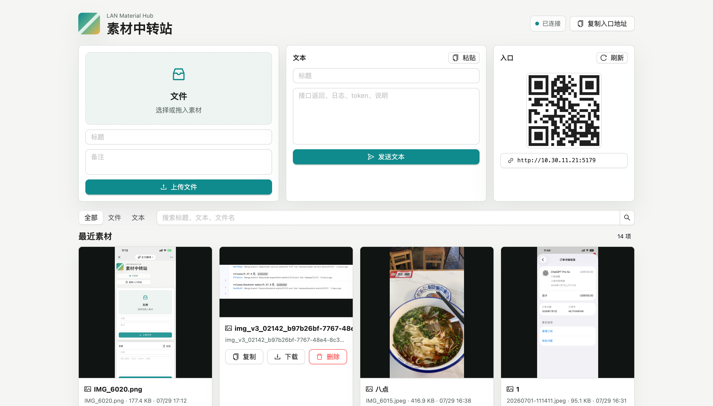
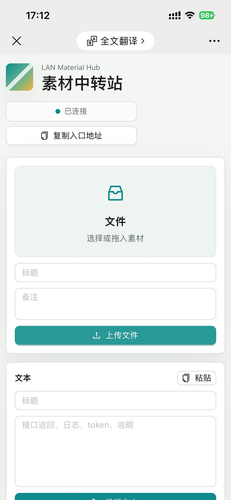
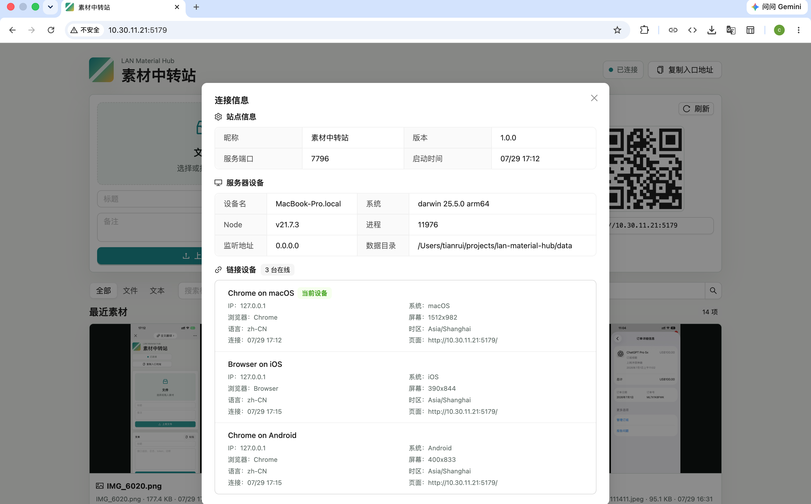

# 素材中转站

一个只跑在本机和局域网内的小工具，用来在手机、PC、测试机之间传递截图、视频、文本、日志、HAR、压缩包等开发素材。

## 预览

### 桌面端



### 移动端



### 连接信息



## 启动

```bash
npm install
npm run build
npm start
```

默认端口是 `7788`。`npm start` 会在后台启动服务，日志会同时打印本机 `localhost` 地址和局域网地址。
如果端口已被占用，服务会自动尝试后续端口，例如 `7788` 被占用时会尝试 `7789`。

## 常用命令

```bash
npm run dev
npm run build
npm run serve
npm start
npm run status
npm run stop
```

- `npm run dev`: 同时启动后端和 Vite React 开发服务
- `npm run build`: 构建 React/antd 前端到 `dist/`
- `npm run serve`: 前台启动 Express，托管已构建的 `dist/`
- `npm start`: 后台启动服务
- `npm run status`: 查看后台服务状态
- `npm run stop`: 停止后台服务

发布成 npm 包后，也可以使用 CLI：

```bash
lan-material-hub start
lan-material-hub status
lan-material-hub stop
```

## 常用配置

```bash
PORT=7799 npm start
PORT_RETRY_LIMIT=50 npm start
DATA_DIR=/Users/tianrui/Desktop/material-data npm start
MAX_FILE_SIZE=2147483648 npm start
LAN_MATERIAL_HUB_HOME=/tmp/lan-material-hub npm start
LAN_MATERIAL_HUB_NICKNAME="办公 Mac" npm start
```

- `PORT`: 起始服务端口，默认 `7788`
- `PORT_RETRY_LIMIT`: 端口被占用时向后重试的次数，默认 `20`
- `DATA_DIR`: 素材保存目录，默认项目内 `data/`
- `MAX_FILE_SIZE`: 单文件大小上限，默认 1 GB
- `LAN_MATERIAL_HUB_HOME`: 后台模式 PID 和日志目录，默认 `~/.lan-material-hub`
- `LAN_MATERIAL_HUB_NICKNAME`: 站点昵称

## 能力

- 多文件上传，支持拖拽、文件选择、剪贴板图片粘贴
- 文本素材保存和一键复制
- React/antd 前端界面
- 可设置站点昵称
- 点击连接状态查看服务器设备和在线链接设备
- antd 图片预览，支持 PC 和移动端
- 视频、音频预览
- 任意文件下载
- PC 和手机浏览器响应式页面
- WebSocket 实时刷新，多端同时打开时自动同步
- 局域网地址和二维码入口

## 发包

```bash
npm pack --dry-run
npm publish
```

`prepack` 会自动执行 `npm run build`，发布包中会包含 `dist/`、`server.js` 和 `bin/`。

## 注意

这个服务默认不做登录鉴权，适合可信局域网或临时自测网络使用。不要在公共 Wi-Fi 或公网端口暴露。
